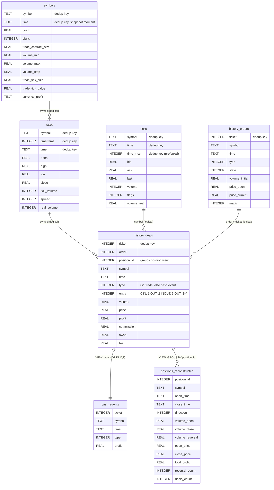

# History Collection (SQLite)

::: mt5cli.history

## `collect-history` schema

The `collect-history` command (and the matching `collect_history` SDK function) writes
selected MT5 datasets into one SQLite database. Each dataset becomes a table; column
names and types mirror the pdmt5 DataFrame schema for that export, with two additions:

- `symbol` is prepended on every table.
- `timeframe` is prepended on `rates` so appended runs at different bar sizes stay
  distinguishable.

SQLite does not declare foreign keys. Rows are linked logically by `symbol`, time
windows, and (for deals) `position_id` / `order`. Duplicate rows are removed on
append using dataset-specific keys (for example `ticket` on history tables, or
`(symbol, timeframe, time)` on rates).

Optional views are created when `--with-views` is set and the `history-deals` dataset
was written.

`ticks` and `symbols` are opt-in datasets (pass `--dataset ticks` /
`--dataset symbols`); they are excluded from the default `rates`,
`history-orders`, `history-deals` selection. Unlike the other datasets,
`symbols` is not a time-windowed history table: each collection or update
writes one row per requested symbol, timestamped with the collection's
`date_to` (one-shot `collect-history`) or the update's end time (incremental
`update_history`). It snapshots broker-reported symbol metadata (`point`,
`digits`, `trade_contract_size`, `volume_min`, `volume_max`, `volume_step`,
`trade_tick_size`, `trade_tick_value`, `currency_profit`) so downstream
consumers can convert `rates.spread` (points) into a relative spread without a
live terminal connection. Metadata is only valid for the account/broker that
produced the snapshot. When a symbol's `point` is missing or zero, the row is
still written with NULL metadata and a warning is logged — a bad symbol never
aborts the rest of the sync.

### Entity-relationship diagram

Sample layout for a full collection with `--with-views`:



### Tables and views

| Object                    | Kind  | Source               | Notes                                                                                       |
| ------------------------- | ----- | -------------------- | ------------------------------------------------------------------------------------------- |
| `rates`                   | table | `copy_rates_range`   | Indexed on `(symbol, timeframe, time)` when columns exist.                                  |
| `ticks`                   | table | `copy_ticks_range`   | Indexed on `(symbol, time)` when columns exist.                                             |
| `history_orders`          | table | `history_orders_get` | Fetched per `--symbol`, then concatenated.                                                  |
| `history_deals`           | table | `history_deals_get`  | Fetched per `--symbol`, then concatenated. Indexed on `(position_id, symbol)` when present. |
| `symbols`                 | table | `symbol_info`        | Opt-in. One row per symbol per collection/update, snapshotted at `date_to` / update end.    |
| `cash_events`             | view  | `history_deals`      | Non-trade deal types (deposits, balance ops, etc.). Requires `type` column.                 |
| `positions_reconstructed` | view  | `history_deals`      | One row per closed `position_id`; volume-weighted prices and reversal stats.                |

Column sets can vary with terminal and pdmt5 version. Views are skipped with a warning
when required columns are missing.

### Incremental collection

The `update_history` SDK path uses the same base tables and optional
`cash_events` / `positions_reconstructed` views. It additionally maintains
`rate_<symbol>__<timeframe>` compatibility views when `create_rate_views=True`.

### Rate view resolution

Downstream tools can resolve mt5cli-managed compatibility view names from an
existing SQLite history database without creating files or guessing naming
schemes:

```python
from pathlib import Path

from mt5cli.history import resolve_rate_view_name, resolve_rate_view_names

# Single symbol and granularity
view = resolve_rate_view_name(Path("history.db"), "EURUSD", "M1")

# Batch resolution in row-major order
views = resolve_rate_view_names(
    Path("history.db"),
    ["EURUSD", "GBPUSD"],
    ["M1", "H1"],
)
```

Resolution rules:

- Returns `rate_<symbol>__<timeframe>` when a symbol stores one timeframe.
- Returns `rate_<symbol>__<granularity>_<timeframe>` when multiple timeframes
  are stored for the same symbol.
- When multiple naming candidates apply, prefers an existing managed
  `rate_*__*` view from the candidate list.
- Falls back to single-timeframe naming when the database path is missing or
  `rates` metadata is unavailable.
- Pass `require_existing=True` to raise `ValueError` instead of returning a
  best-guess name when the database or view is missing.
- Accepts either a SQLite path or an open `sqlite3.Connection`.

### Rate data loading

The canonical normalized rate table is `rates`; compatibility views are named
with `rate_<symbol>__<timeframe>` for single-timeframe symbols or
`rate_<symbol>__<granularity>_<timeframe>` when a symbol has multiple stored
timeframes. `resolve_rate_table_name()` returns `rates`, while
`resolve_rate_view_name()` returns the per-symbol compatibility view name.

Use `load_rate_data()` or `load_rate_series_from_sqlite(..., table=...)` to load
a single table or view from a SQLite path. Use
`load_rate_series_by_granularity()` to load multiple instrument/granularity
targets without hard-coding view names:

```python
from pathlib import Path

from mt5cli import (
    load_rate_series_by_granularity,
    load_rate_series_from_sqlite,
)
from mt5cli.history import (
    load_rate_data,
    resolve_rate_table_name,
    resolve_rate_view_name,
)

view = resolve_rate_view_name(Path("history.db"), "EURUSD", "M1", require_existing=True)
rates = load_rate_data(Path("history.db"), view, count=1000)
same_rates = load_rate_series_from_sqlite(Path("history.db"), table=view, count=1000)

table = resolve_rate_table_name("EURUSD", "M1")  # "rates"
series = load_rate_series_by_granularity(
    Path("history.db"),
    symbols=["EURUSD", "GBPUSD"],
    granularities=["M1", "H1"],
    count=500,
)
```

`count` returns the latest rows while preserving chronological order. Missing
tables/views and mismatched `explicit_tables` lengths raise `ValueError` with
the requested database target in the message.

The loader accepts close-based OHLC rate data or tick-like bid/ask data. It
validates that `time` exists, parses timestamps with pandas, and returns a
DataFrame indexed by ascending `DatetimeIndex` named `time`.

### Multi-series rate loading

For loading many rate series at once, build neutral `RateTarget` pairs and load
them from SQLite in one call. View names are resolved via the same
compatibility-view rules, or you can pass `explicit_tables` to bypass resolution:

```python
from pathlib import Path

from mt5cli import build_rate_targets, load_rate_series_from_sqlite

targets = build_rate_targets(["EURUSD", "GBPUSD"], ["M1", "H1"])
series = load_rate_series_from_sqlite(Path("history.db"), targets, count=1000)
frame = series["EURUSD", 1]  # keyed by (symbol, integer timeframe)
```

- `build_rate_targets()` returns `RateTarget(symbol, timeframe)` pairs in
  row-major order, normalizing timeframe names such as `"M1"` to their integer
  values; set `allow_missing_symbol=True` to address series solely by
  `explicit_tables` (targets carry `symbol=None`).
- `resolve_rate_tables()` maps targets to table or view names and validates that
  any `explicit_tables` count matches the target count. Pass
  `require_existing=True` to raise `ValueError` instead of returning a
  best-guess name when the database or managed view is missing. When
  `explicit_tables` is provided, names are returned as-is and
  `require_existing` is ignored.
- `load_rate_series_from_sqlite()` returns a mapping keyed by
  `(symbol, integer timeframe)`. Unless `explicit_tables` is supplied, it
  requires existing managed `rate_*__*` compatibility views and raises
  `ValueError` when they are missing. Duplicate `(symbol, timeframe)` targets
  are rejected.
- `load_rate_series_by_granularity()` is a thin wrapper that builds the targets,
  loads the series, and rekeys the result by granularity name to avoid
  converting integer timeframes downstream:

  ```python
  from mt5cli import load_rate_series_by_granularity

  series = load_rate_series_by_granularity(
      "history.db", ["EURUSD"], ["M1", "H1"], count=1000
  )
  frame = series["EURUSD", "M1"]  # keyed by (symbol | None, granularity_name)
  ```
