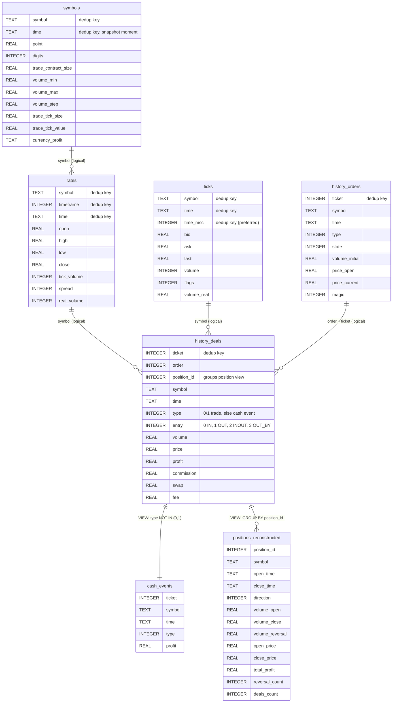

# History Collection (SQLite)

::: mt5cli.history

## `collect-history` schema

The `collect-history` command (and the matching `collect_history` SDK function) writes
selected MT5 datasets into one SQLite database. Each dataset becomes a table; column
names and types mirror the pdmt5 DataFrame schema for that export, with two additions:

- `symbol` is prepended on every table.
- `timeframe` is prepended on `rates` so appended runs at different bar sizes stay
  distinguishable.

SQLite does not declare foreign keys. Rows are linked logically by `symbol`, time
windows, and (for deals) `position_id` / `order`. Duplicate rows are removed on
append using dataset-specific keys (for example `ticket` on history tables, or
`(symbol, timeframe, time)` on rates).

Optional views are created when `--with-views` is set and the `history-deals` dataset
was written.

`ticks` and `symbols` are opt-in datasets (pass `--dataset ticks` /
`--dataset symbols`); they are excluded from the default `rates`,
`history-orders`, `history-deals` selection. Unlike the other datasets,
`symbols` is not a time-windowed history table: each collection or update
writes one row per requested symbol, timestamped with the collection's
`date_to` (one-shot `collect-history`) or the update's end time (incremental
`update_history`). It snapshots broker-reported symbol metadata (`point`,
`digits`, `trade_contract_size`, `volume_min`, `volume_max`, `volume_step`,
`trade_tick_size`, `trade_tick_value`, `currency_profit`) so downstream
consumers can convert `rates.spread` (points) into a relative spread without a
live terminal connection. Metadata is only valid for the account/broker that
produced the snapshot. When a symbol's `point` is missing or zero, the row is
still written with NULL metadata and a warning is logged — a bad symbol never
aborts the rest of the sync.

### Entity-relationship diagram

Sample layout for a full collection with `--with-views`:


```mermaid
erDiagram
    rates {
        TEXT symbol "dedup key"
        INTEGER timeframe "dedup key"
        TEXT time "dedup key"
        REAL open
        REAL high
        REAL low
        REAL close
        INTEGER tick_volume
        INTEGER spread
        INTEGER real_volume
    }

    ticks {
        TEXT symbol "dedup key"
        TEXT time "dedup key"
        INTEGER time_msc "dedup key (preferred)"
        REAL bid
        REAL ask
        REAL last
        INTEGER volume
        INTEGER flags
        REAL volume_real
    }

    history_orders {
        INTEGER ticket "dedup key"
        TEXT symbol
        TEXT time
        INTEGER type
        INTEGER state
        REAL volume_initial
        REAL price_open
        REAL price_current
        INTEGER magic
    }

    history_deals {
        INTEGER ticket "dedup key"
        INTEGER order
        INTEGER position_id "groups position view"
        TEXT symbol
        TEXT time
        INTEGER type "0/1 trade, else cash event"
        INTEGER entry "0 IN, 1 OUT, 2 INOUT, 3 OUT_BY"
        REAL volume
        REAL price
        REAL profit
        REAL commission
        REAL swap
        REAL fee
    }

    symbols {
        TEXT symbol "dedup key"
        TEXT time "dedup key, snapshot moment"
        REAL point
        INTEGER digits
        REAL trade_contract_size
        REAL volume_min
        REAL volume_max
        REAL volume_step
        REAL trade_tick_size
        REAL trade_tick_value
        TEXT currency_profit
    }

    cash_events {
        INTEGER ticket
        TEXT symbol
        TEXT time
        INTEGER type
        REAL profit
    }

    positions_reconstructed {
        INTEGER position_id
        TEXT symbol
        TEXT open_time
        TEXT close_time
        INTEGER direction
        REAL volume_open
        REAL volume_close
        REAL volume_reversal
        REAL open_price
        REAL close_price
        REAL total_profit
        INTEGER reversal_count
        INTEGER deals_count
    }

    rates ||--o{ history_deals : "symbol (logical)"
    ticks ||--o{ history_deals : "symbol (logical)"
    history_orders ||--o{ history_deals : "order ~ ticket (logical)"
    symbols ||--o{ rates : "symbol (logical)"
    history_deals ||--|| cash_events : "VIEW: type NOT IN (0,1)"
    history_deals ||--o{ positions_reconstructed : "VIEW: GROUP BY position_id"
```

### Tables and views

| Object                    | Kind  | Source               | Notes                                                                                       |
| ------------------------- | ----- | -------------------- | ------------------------------------------------------------------------------------------- |
| `rates`                   | table | `copy_rates_range`   | Indexed on `(symbol, timeframe, time)` when columns exist.                                  |
| `ticks`                   | table | `copy_ticks_range`   | Indexed on `(symbol, time)` when columns exist.                                             |
| `history_orders`          | table | `history_orders_get` | Fetched per `--symbol`, then concatenated.                                                  |
| `history_deals`           | table | `history_deals_get`  | Fetched per `--symbol`, then concatenated. Indexed on `(position_id, symbol)` when present. |
| `symbols`                 | table | `symbol_info`        | Opt-in. One row per symbol per collection/update, snapshotted at `date_to` / update end.    |
| `cash_events`             | view  | `history_deals`      | Non-trade deal types (deposits, balance ops, etc.). Requires `type` column.                 |
| `positions_reconstructed` | view  | `history_deals`      | One row per closed `position_id`; volume-weighted prices and reversal stats.                |

Column sets can vary with terminal and pdmt5 version. Views are skipped with a warning
when required columns are missing.

### Incremental collection

The package-root `mt5cli.update_history` SDK path uses the normalized `rates`
table and optional `cash_events` / `positions_reconstructed` views. It writes the canonical normalized `rates` table directly and does not
maintain per-series compatibility views.


### Rate data loading

The canonical managed rate store is the normalized `rates` table. Stable
symbol/timeframe reads query that table directly; mt5cli does not create,
discover, resolve, or maintain per-series `rate_*` compatibility views.

Use `load_rate_series_from_sqlite()` or
`load_rate_series_by_granularity()` for canonical managed data:

```python
from pathlib import Path

from mt5cli import (
    build_rate_targets,
    load_rate_series_by_granularity,
    load_rate_series_from_sqlite,
)

path = Path("history.db")
targets = build_rate_targets(["EURUSD", "GBPUSD"], ["M1", "H1"])
series = load_rate_series_from_sqlite(path, targets, count=1000)
eurusd_m1 = series["EURUSD", 1]

by_name = load_rate_series_by_granularity(
    path,
    symbols=["EURUSD", "GBPUSD"],
    granularities=["M1", "H1"],
    count=500,
)
eurusd_m1_named = by_name["EURUSD", "M1"]
```

Canonical reads apply `count` in SQLite and return the selected rows in
chronological order. Each returned series uses an ascending `DatetimeIndex`
named `time`. Timezone-naive MT5 trade-server wall-clock timestamps remain
naive; explicitly timezone-aware timestamps preserve their instant and are
normalized to UTC.

`explicit_tables` and the single-table `table=` form are reserved for
intentionally named custom tables. They do not discover or fall back to
managed per-series views. Explicit table counts must match target counts, and
duplicate `(symbol, timeframe)` targets are rejected.

`load_rate_data()` / `load_rate_data_from_connection()` remain available for
low-level explicit-table reads. These helpers validate that `time` exists and
return an ascending `DatetimeIndex` named `time`.

## Throttled incremental history updates

`ThrottledHistoryUpdater` wraps `update_history()` with a minimum interval
between successful runs (using a monotonic clock), so an application loop can
call it every iteration without over-fetching.

```python
from pdmt5 import Mt5Config

from mt5cli import ThrottledHistoryUpdater, mt5_session
from mt5cli.utils import Dataset

updater = ThrottledHistoryUpdater(
    output="history.db",
    datasets={Dataset.rates},
    timeframes=["M1"],
    interval_seconds=60,  # <= 0 updates on every call
)

with mt5_session(Mt5Config(login=12345)) as client:
    while True:
        updater.update(client, ["EURUSD", "GBPUSD"])  # no-op until 60s elapse
        # ... do other work; break when shutting down ...
```

Pass `update_backend` to substitute the default `update_history` implementation
without monkey-patching `mt5cli.history.update_history`. The callable receives the
same keyword arguments as `update_history` (`client`, `output`, `symbols`,
`datasets`, `timeframes`, `flags`, `lookback_hours`, `with_views`,
`include_account_events`). The resolved backend is stored on
`updater.update_backend` for inspection or subclassing.

```python
from mt5cli import ThrottledHistoryUpdater, update_history


def app_update_history(**kwargs) -> None:
    update_history(**kwargs)  # or delegate to application-specific logic


updater = ThrottledHistoryUpdater(
    output="history.db",
    interval_seconds=60,
    update_backend=app_update_history,
)
```

By default recoverable errors (`Mt5RuntimeError`, `sqlite3.Error`,
`ValueError`, `OSError`) propagate so the caller controls logging; pass
`suppress_errors=True` to swallow them and return `False` without advancing the
throttle. `AttributeError` and `TypeError` are treated as caller programming
errors and always propagate, even when `suppress_errors=True` — the client
passed to `update()` must implement the canonical `HistoryClient` method names
(`copy_rates_range`, `copy_ticks_range`, `history_orders`, `history_deals`,
`symbol_info_as_dict`). Input validation (`_resolve_update_history_request`)
runs before any MT5 or SQLite calls, but when `suppress_errors=True` the
resulting `ValueError` is suppressed along with other recoverable errors.
