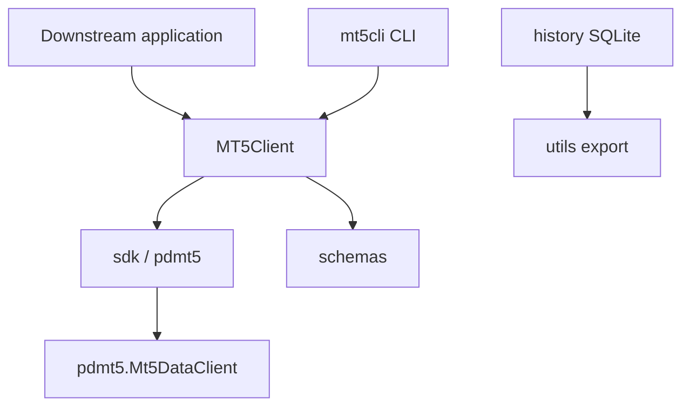

# API Reference

This section documents the mt5cli public Python API and CLI modules.

Start with the [Public API Contract](public-contract.md) for the stable
downstream SDK surface, CLI boundary, internal modules, and out-of-scope strategy
responsibilities.

## Public API layers

| Module                                    | Purpose                                                                   |
| ----------------------------------------- | ------------------------------------------------------------------------- |
| [Public API Contract](public-contract.md) | Stable downstream SDK exports, CLI boundary, and out-of-scope items       |
| [Client](client.md)                       | `MT5Client` session abstraction for data access and order primitives      |
| [Schemas](schemas.md)                     | Canonical DataFrame contracts and normalization helpers                   |
| [Converters](converters.md)               | Symbol, timeframe, timezone, and date-range utilities                     |
| [Exceptions](exceptions.md)               | Stable mt5cli exception types and MT5 error normalization                 |
| [SDK](sdk.md)                             | Module-level fetch helpers, multi-account collectors, incremental history |
| [Trading](trading.md)                     | Trading-capable sessions and operational helpers                          |
| [History Collection (SQLite)](history.md) | SQLite schema, incremental writes, dedup, and rate views                  |
| [CLI](cli.md)                             | Typer commands that delegate to the Python API                            |
| [Utils](utils.md)                         | Parsing helpers and Click parameter types                                 |

## Architecture overview



Downstream packages should depend on the package root exports documented in the
[Public API Contract](public-contract.md) (`MT5Client`,
`collect_history`, `load_rate_series_from_sqlite`, etc.) rather than private
modules. Lower-level helpers are accessible directly from their owning modules.

`MT5Client.order_send()` is a live execution primitive that can place real trades. mt5cli exposes minimal execution helpers only; strategy logic, signals, backtests, and optimization remain out of scope and must be implemented downstream with explicit execution gating.

## Quick start

```python
from mt5cli import MT5Client, build_config, mt5_session

with mt5_session(build_config(login=12345)) as client:
    rates = client.copy_rates_range("EURUSD", "H1", "2024-01-01", "2024-02-01")
    positions = client.positions()
```

```bash
mt5cli -o account.csv account-info
mt5cli -o rates.parquet rates-range --symbol EURUSD --timeframe H1 \
  --date-from 2024-01-01 --date-to 2024-02-01
```

See individual module pages for detailed usage examples.
