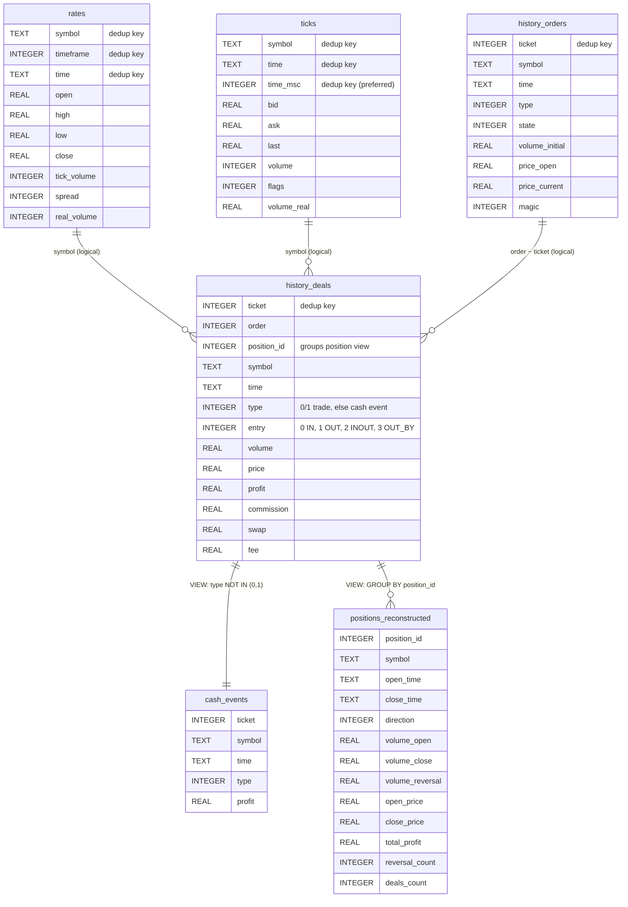

# SQLite History Module

::: mt5cli.sqlite_history

## `collect-history` schema

The `collect-history` command (and the matching `collect_history` SDK function) writes
selected MT5 datasets into one SQLite database. Each dataset becomes a table; column
names and types mirror the pdmt5 DataFrame schema for that export, with two additions:

- `symbol` is prepended on every table.
- `timeframe` is prepended on `rates` so appended runs at different bar sizes stay
  distinguishable.

SQLite does not declare foreign keys. Rows are linked logically by `symbol`, time
windows, and (for deals) `position_id` / `order`. Duplicate rows are removed on
append using dataset-specific keys (for example `ticket` on history tables, or
`(symbol, timeframe, time)` on rates).

Optional views are created when `--with-views` is set and the `history-deals` dataset
was written.

### Entity-relationship diagram

Sample layout for a full collection with `--with-views`:

### Tables and views

| Object                    | Kind  | Source               | Notes                                                                                       |
| ------------------------- | ----- | -------------------- | ------------------------------------------------------------------------------------------- |
| `rates`                   | table | `copy_rates_range`   | Indexed on `(symbol, timeframe, time)` when columns exist.                                  |
| `ticks`                   | table | `copy_ticks_range`   | Indexed on `(symbol, time)` when columns exist.                                             |
| `history_orders`          | table | `history_orders_get` | Fetched per `--symbol`, then concatenated.                                                  |
| `history_deals`           | table | `history_deals_get`  | Fetched per `--symbol`, then concatenated. Indexed on `(position_id, symbol)` when present. |
| `cash_events`             | view  | `history_deals`      | Non-trade deal types (deposits, balance ops, etc.). Requires `type` column.                 |
| `positions_reconstructed` | view  | `history_deals`      | One row per closed `position_id`; volume-weighted prices and reversal stats.                |

Column sets can vary with terminal and pdmt5 version. Views are skipped with a warning
when required columns are missing.

### Incremental collection

The `update_history` SDK path uses the same base tables and optional
`cash_events` / `positions_reconstructed` views. It additionally maintains
`rate_<symbol>__<timeframe>` compatibility views when `create_rate_views=True`.
